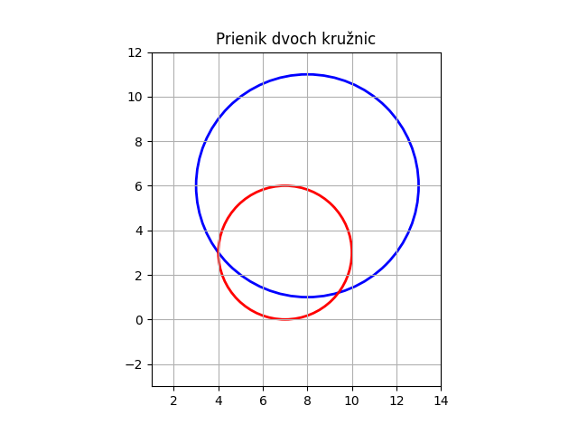
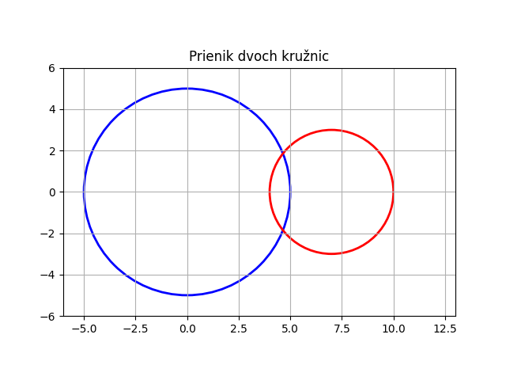

#Circle_project

#circle_stats.py obsahuje funckcie :
-radius_sum ktora vracia priemer jednotlivych kruhov
-euclid_dist vracia euklidovsku vzdialenost
-has_intersection zisti ci sa kruznice pretinaju

#circle_intersection.py
-zavola funckiu z modulu circle_stats.py
-vypise vysledok ci sa kruznice pretinaju

#circle_intersection.py:
-hlavny skript vypise vysledok prieniku kruznic

     